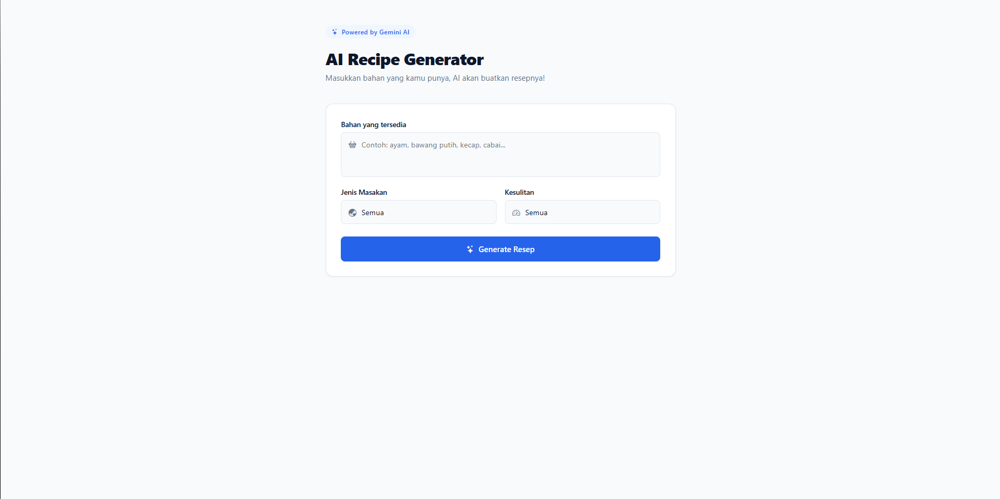

# 🍳 AI Recipe Generator

A smart recipe generator web app built with **React 18** + **Vite**, powered by **Google Gemini AI**. Input ingredients you have at home and let AI create a complete recipe for you instantly.

## ✨ Features

- 🤖 AI-powered recipe generation using Google Gemini 2.5 Flash
- 🧂 Input any ingredients you have available
- 🌏 Filter by cuisine type (Indonesian, Japanese, Korean, Italian, etc.)
- 📊 Filter by difficulty level (Easy, Medium, Hard)
- 📋 Structured output with ingredients list, step-by-step instructions, and cooking tips
- 💡 Clean, modern, and responsive UI
- ⚡ Fast and lightweight with Vite

## 🛠️ Tech Stack

- **React 18**
- **Vite**
- **Google Gemini AI** (`@google/generative-ai`)
- **Bootstrap Icons**

## 🚀 Getting Started

### 1. Clone the repository

```bash
git clone https://github.com/username/ai-recipe-generator.git
cd ai-recipe-generator
```

### 2. Install dependencies

```bash
npm install
```

### 3. Get a Gemini API Key

1. Go to [Google AI Studio](https://aistudio.google.com)
2. Sign in with your Google account
3. Click **"Get API Key"** → **"Create API Key"**
4. Copy your API key

### 4. Setup environment variables

Create a `.env` file in the root directory:

```env
VITE_GEMINI_KEY=your_api_key_here
```

> ⚠️ Never commit your `.env` file to GitHub. Make sure `.env` is listed in `.gitignore`.

### 5. Run the development server

```bash
npm run dev
```

Open [http://localhost:5173](http://localhost:5173) in your browser.

## 📁 Project Structure

```
src/
├── components/
│   ├── RecipeForm.jsx       # Input form (ingredients, cuisine, difficulty)
│   ├── RecipeResult.jsx     # Display generated recipe
│   └── LoadingSpinner.jsx   # Loading animation
├── hooks/
│   └── useRecipeGenerator.js  # Gemini API logic
├── App.jsx
└── index.css
```

## 📸 Preview



## 🔒 Environment Variables

| Variable | Description |
|---|---|
| `VITE_GEMINI_KEY` | Your Google Gemini API Key |

## 📄 License

MIT License © 2026